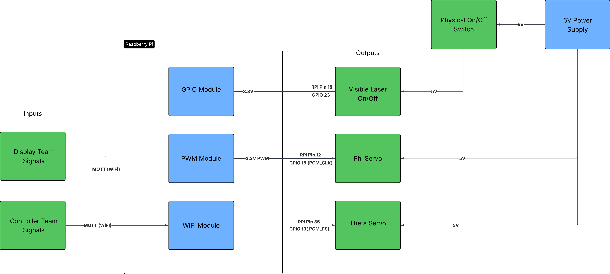
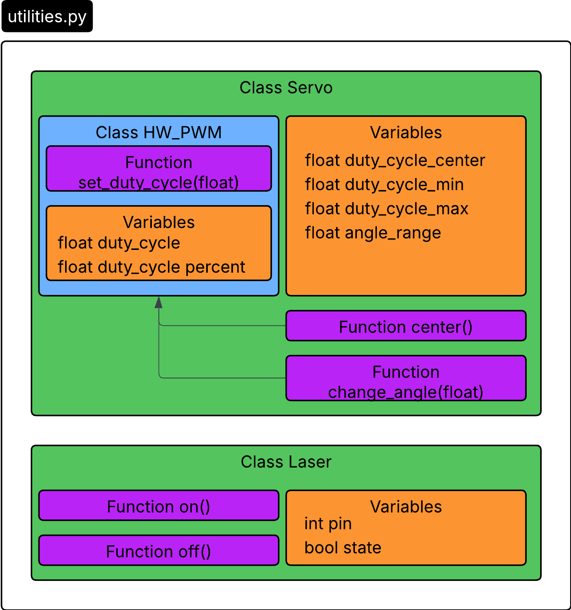

# LaserLock
This project was the final project for my embedded systems class (ELC 4438). As a collective class, we were assigned to create a laser tag-like game using Raspberry Pis and other microcontrollers. The project was split into four groups:
- Target Team: Designed physical targets for the laser, the circuits needed to support them, and code to control logic
- Display Team: Controlled the overall game logic, created UI for player, and communicated events and stages in the game to other teams
- Laser Team (my team): Designed and constructed the housing for our turret system and coded the servos to move based on inputs from the controller and display team
- Controller Team: Designed the physical controller used to aim the laser turret, as well as when to "shoot" the laser at the target

## Game Objective and Logic
Laser Lock resembles the 1984 NES game "Duck Hunt", but incorporates a more physical aspect for the player to interact with. In Laser Lock, there are three targets set up, however, only one lights up at a time, indicating which target the player should shoot at to gain points. These targets use photodiodes to detect light, which are used to register when the laser is pointing at the target. The laser, indicating where the player is aiming, is attached to a servo turret system. The servos driving this turret are controlled by the controller (surprise), which wirelessly communicates the orientation of the controller in free space via MQTT using an ESP32 microcontroller. The controller is 100% wireless and battery powered. The controller is held in the hands of the player, where the player points the front of the controller where they want the laser to go. The ESP32 reads from a gyroscope attached to the controller and sends that data to the laser team to control where the laser is pointing (by driving the servo turret).
There are three difficulties in Laser Lock. The hardest of the three gives you less time to hit the assigned target, and punishes you harder if you miss. When you hit a target, however, you get more points than on the easier difficulties. The easiest difficulty is the inverse of this - plenty of time to hit targets, not punished as hard for misses, but less points per hit.

## Laser Team
My team had to design a system that could position a laser in two dimensions (phi and theta angles), turn the laser on and off with software, as well as incorporate an emergency shut-off switch for the laser that would work independently of software. Here's the architecture diagram to illustrate the inputs and outputs of our system:

To organize these parts, we modified a wooden box/chest we got on Amazon, where most of the circuitry was stored inside the chest, and the turret was mounted on top. Also not clearly shown is the laser emergency shutoff switch, where the switch itself is on the exterior side of the chest. You can still see the switch in the bottom left of the chest.

  

  

Here's a video of the whole system working in action!

https://www.youtube.com/shorts/vXV5eVcAdMg

Here's another video on instagram:
https://www.instagram.com/p/DSXw9y3EawV/

## My role
I was the software lead which meant I was responsible for all the code that went into controlling the servos. The code is in this repository if you want to look through exactly what I did, but here's also a data structure and activity diagram to illustrate my work at a high level

  

  

